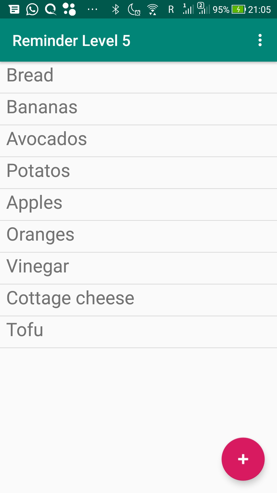
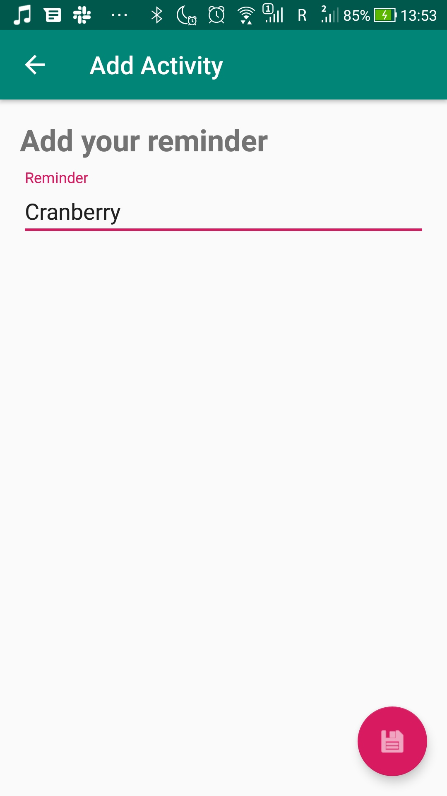

# Level 5 Example - Architecture Components
This is the example that was shown on the fourth seminar. The layout is the same as in the level 4 example. However, this time we have set a goal to use such architecture components as ViewModel and LiveData.
## What's inside
This is the app that can be used to write down your reminders. Basically, it's the same as the example for level 4. However, this time we use more advanced architecture and therefore the quality of our codebase is higher.
## Screenshots
    
